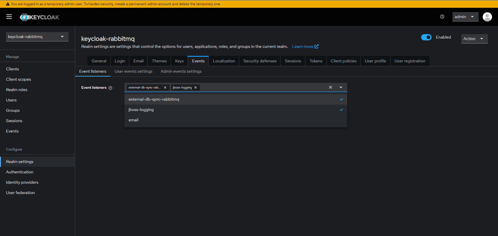

# Custom Keycloak Event Listener with RabbitMQ and Spring Boot

This project demonstrates a custom Keycloak event listener that sends user data to a RabbitMQ queue. A Spring Boot
application consumes the messages from the queue and persists the user data to a database.

In a traditional setup, you could directly send a REST request from Keycloak to the backend service. However, if the
backend is temporarily unavailable, the request will be lost forever. By using RabbitMQ as a message broker,
the events are safely queued until the backend service is back online, ensuring no data loss and providing better
reliability for user-related events.

## Technologies Used

- Java
- Spring Boot
- RabbitMQ
- Keycloak
- Maven
- SQL

## Project Structure

- `backend`: Contains the Spring Boot application.
- `custom-event-listener`: Contains the custom Keycloak event listener.
- `docker-compose.yml`: Docker Compose file for setting up Keycloak and PostgreSQL.
- `providers`: Contains the Keycloak provider configuration.

## Setup and Running the Project

### Prerequisites

- Java 17 or higher
- Maven
- RabbitMQ
- Keycloak
- A SQL database (e.g., MySQL, PostgreSQL). I'm using PostgreSQL for this project.

### Steps

1. **Clone the repository:**
    ```sh
    git clone <repository-url>
    cd <repository-directory>
    ```

2. **Configure RabbitMQ:**
   Ensure RabbitMQ is running and accessible. Update the RabbitMQ configuration in your Spring Boot application
   properties.
   RabbitMQ is available at:
   ➡️ http://localhost:15672/
   ➡️ Username: admin
   ➡️ Password: admin

3. **Configure Keycloak:**
    - Set up Keycloak and configure the custom event listener to send user data to the RabbitMQ queue.
        - Build the custom event listener JAR file:
          ```sh
          cd custom-event-listener
          mvn clean package
          ```
        - ⚠️ Important Note:
          This process generates two JAR files inside the target/ directory:
          custom-event-listener-1.0.0.jar: This is the shaded JAR, which includes all required dependencies (
          including
          the RabbitMQ client library).
          original-custom-event-listener-1.0.0.jar: This is the original JAR without dependencies.
          Since Keycloak does not provide the RabbitMQ client dependency by default, you must use the shaded JAR to
          ensure the listener works correctly inside the Keycloak environment.

          Copy the shaded JAR to the providers directory (this is the directory you will mount in the container):
           ```sh
            cp target/custom-event-listener-1.0.0.jar ../providers
          ```
        - Mount the JAR file to the Keycloak container:
            ```  keycloak:
            image: quay.io/keycloak/keycloak:26.1.3
            container_name: keycloak
            environment:
            KC_BOOTSTRAP_ADMIN_USERNAME: admin
            KC_BOOTSTRAP_ADMIN_PASSWORD: admin
            volumes:
            - ./providers:/opt/keycloak/providers
            ports:
            - "8085:8080"
            command:
            - start-dev
            networks:
            - keycloak_network
            ```
        - Start the Keycloak container:
          ```sh
          docker-compose up
          ```
        - In the Keycloak admin console, navigate to **Realm Settings** -> **Events** and add the custom event listener.
          

4. **Configure the Database:**
   Update the database configuration in your Spring Boot application properties.

5. **Build and Run the Spring Boot Application:**
    ```sh
    mvn clean install
    mvn spring-boot:run
    ```

## How It Works

1. **Keycloak Event Listener:** The custom Keycloak event listener captures user-related events (e.g., user creation,
   update) and sends the user data to a RabbitMQ queue.
2. **RabbitMQ:** Acts as a message broker, queuing the user data messages.
3. **Spring Boot Application:** Consumes the messages from the RabbitMQ queue and persists the user data to the
   database.

## Acknowledgements

- [Spring Boot](https://spring.io/projects/spring-boot)
- [RabbitMQ](https://www.rabbitmq.com/)
- [Keycloak](https://www.keycloak.org/)